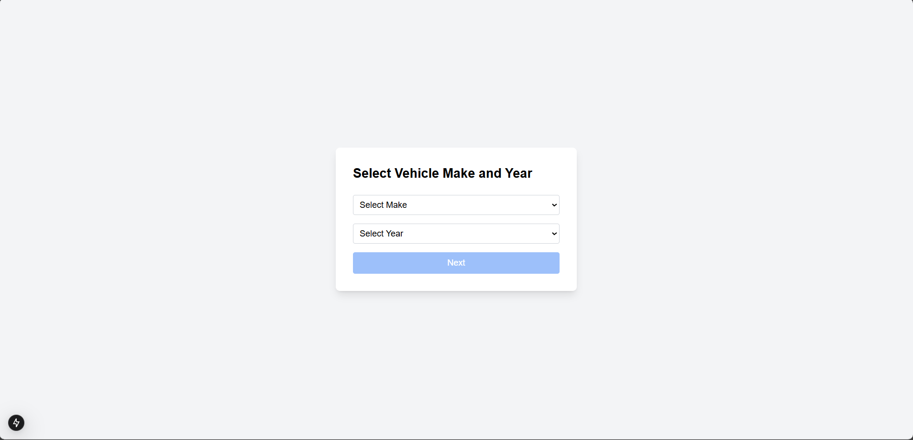
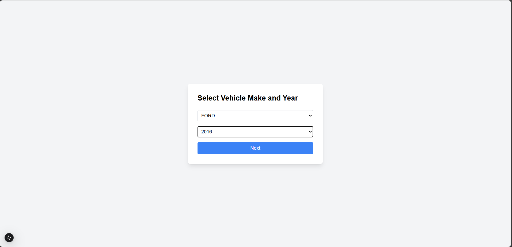
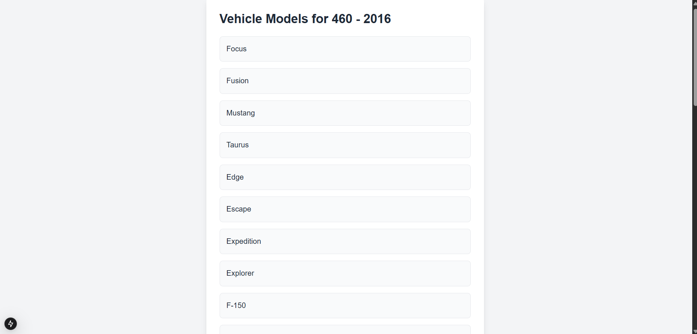

# Vehicle Models App

This is a web application that allows users to select a vehicle make and model year, and view the corresponding vehicle models. The app fetches vehicle makes and model details from an external API (NHTSA API). The app is built using **Next.js** and **React** with **Tailwind CSS** for styling.

## Features

- **Vehicle Make Selector**: Select from a list of vehicle makes.
- **Model Year Selector**: Select the model year (from 2015 to the current year).
- **Vehicle Models Display**: Once a make and model year are selected, the app displays a list of available vehicle models for the chosen criteria.
- **Error Handling**: Displays error messages if fetching data fails.
- **Suspense for Loading**: Implements React’s `Suspense` for a smooth loading experience.

## Tech Stack

- **Next.js**: A React framework for building static and server-side rendered applications.
- **React**: A JavaScript library for building user interfaces.
- **Tailwind CSS**: A utility-first CSS framework for styling.
- **NHTSA API**: External API to fetch vehicle data.

## How to Run and Build the Application

### Prerequisites

Make sure you have **Node.js** and **npm** installed. You can check if they're installed by running the following commands:

```bash
node -v
npm -v

## Clone the Repository:

git clone https://github.com/brahayarn/Car-Dealer-App.git

cd Car-Dealer-App

npm install
or
yarn install

## Set Environment Variables
Create a .env.local file in the root of the project and add the following:

NEXT_PUBLIC_API_URL=https://vpic.nhtsa.dot.gov/api


## Start the Development Server:

npm run dev
or 
yarn dev

The app will be available at http://localhost:3000

##Build and Deploy
npm run build
or
yarn build


## Screenshots

#### Home Page Before Selection


#### Home Page After Selection


#### Result Page
